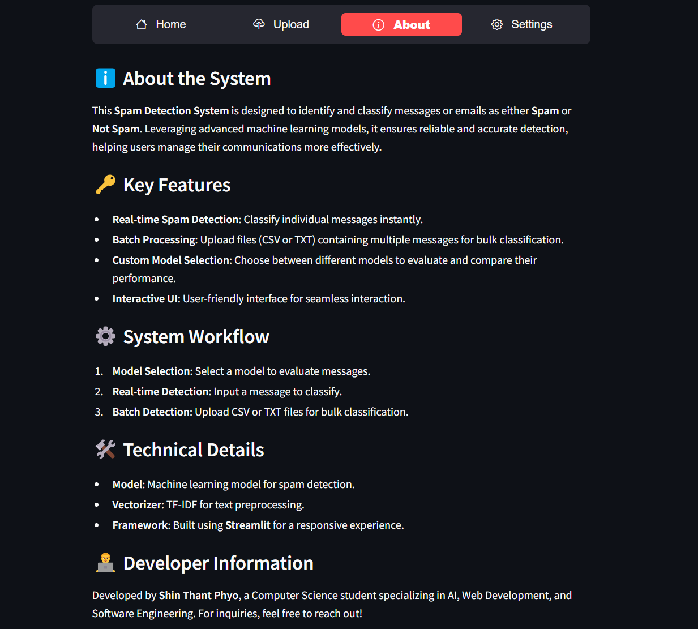
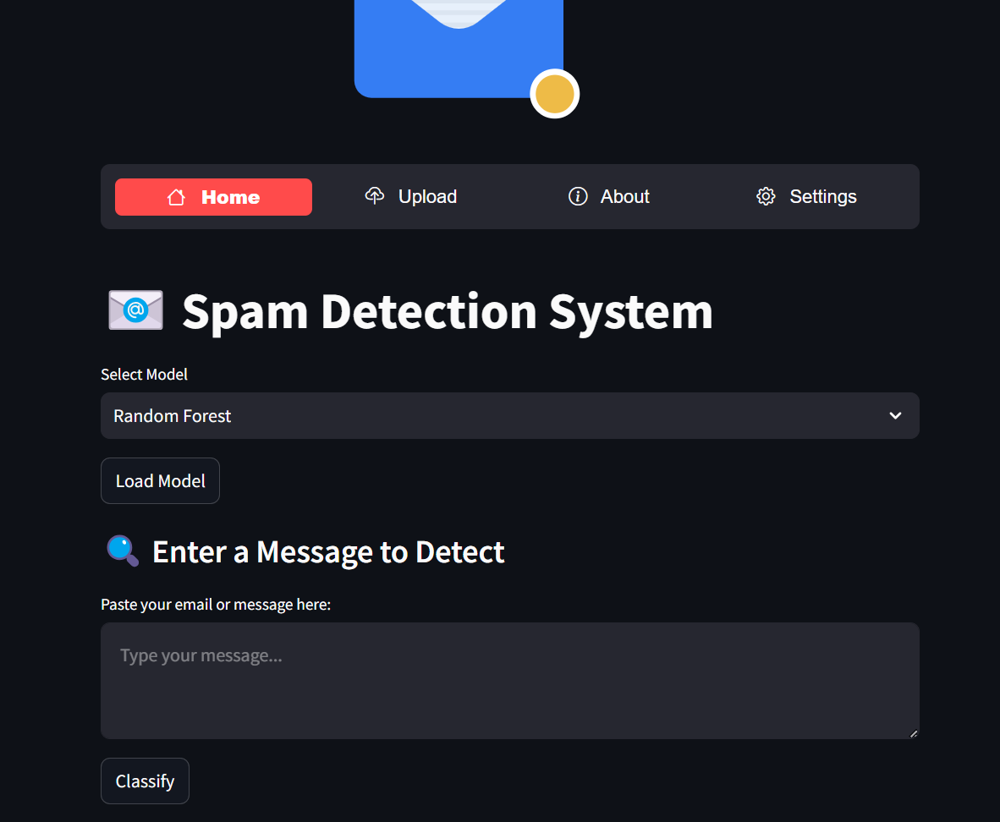
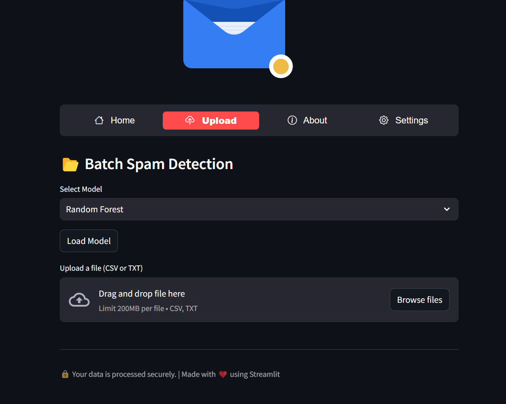
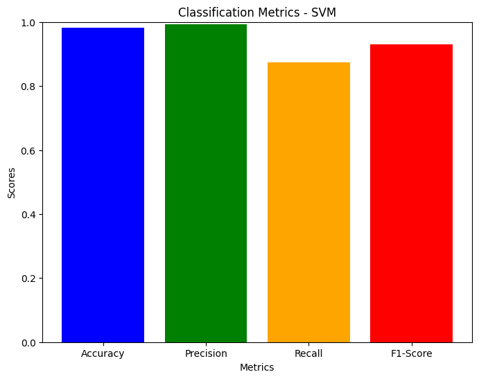

# Spam Detection AI Streamlit Application

**Prepared by**: Shin Thant Phyo  
**Institution**: -  
**Date**: January 2025

## Project Overview

This project is a **Spam Detection AI** application built with **Streamlit**. It is designed to classify text messages as either **spam** or **not spam (ham)**. The system leverages machine learning models to predict the category of the input message, using algorithms such as **Random Forest**, **Logistic Regression** and **Support Vector Machine (SVM)**.

The web application allows users to:
- Input messages directly to be classified.
- Upload `.txt` files to analyze their content.
- View real-time classification results, including spam prediction with a clear, user-friendly interface.

## Features

- **Text Input**: Users can enter a text message, and the system will classify it as spam or ham.
- **File Upload**: Users can upload `.txt` files, and the application will classify the message inside the file as spam or ham.
- **Real-Time Prediction**: The application processes the input in real-time and displays the result instantly.

### Application Screenshot:
 <!-- Replace with actual screenshot path -->

## Dataset

The **SMS Spam Collection Dataset** was used for training the machine learning models.

- **Source**: [UCI Machine Learning Repository](https://archive.ics.uci.edu/ml/datasets/SMS+Spam+Collection)
- **Description**: A collection of 5,574 labeled SMS messages, with categories "ham" (non-spam) and "spam."
- **Spam Messages**: 747
- **Ham Messages**: 4,827

This dataset is highly suitable for spam detection because it contains a diverse set of messages in English.

### Dataset Statistics:
```bash
from sklearn.feature_extraction.text import TfidfVectorizer
from sklearn.model_selection import train_test_split

# Features and labels
X = data['message']
y = data['label']

# Text to numeric vectors using TF-IDF
tfidf = TfidfVectorizer(stop_words='english', max_features=3000)
X_tfidf = tfidf.fit_transform(X)

# Split into training and testing sets
X_train, X_test, y_train, y_test = train_test_split(X_tfidf, y, test_size=0.2, random_state=42)
```

## Libraries Used

The following libraries were used to implement this project:

- **Streamlit**: For creating the interactive web interface.
- **scikit-learn**: For building the machine learning models (Random Forest, SVM).
- **pandas**: For data manipulation and processing.
- **numpy**: For numerical operations.
- **pickle**: For serializing and deserializing the trained model.

## How to Run the Project

To run this project locally, follow these steps:

1. **Clone the repository**:
    ```bash
    git clone https://github.com/yourusername/spam-detection-streamlit.git
    cd spam-detection-streamlit
    ```

2. **Install dependencies**:
    ```bash
    pip install -r requirements.txt
    ```

3. **Run the Streamlit application**:
    ```bash
    streamlit run app.py
    ```

4. Open your browser and navigate to:  
   [http://localhost:8501](http://localhost:8501)

5. **Use the features**:
    - **Text Input Box**: Type or paste a message to be classified as spam or ham.
    - **File Upload Button**: Upload a `.txt` file to classify its contents.

### Additional Screenshot:
1. **Home**
  <!-- Replace with actual model prediction image -->
2. **Batch**
 


## How It Works

The system uses the **SMS Spam Collection Dataset** to train a machine learning model to classify SMS messages as spam or ham. The machine learning pipeline consists of the following steps:

1. **Text Preprocessing**: 
    - Tokenization: Breaking down the message into individual words.
    - Vectorization: Converting text into numerical form using `TfidfVectorizer`.

2. **Model Training**: 
    - The model is trained using algorithms like **Random Forest**,**Logistic Regression** or **Support Vector Machine (SVM)**.

3. **Prediction**: 
    - Once trained, the model can classify unseen messages as spam or ham.

### Model Architecture Diagram:
  <!-- Replace with actual model architecture diagram -->

## Evaluation Metrics

The following metrics were used to evaluate the model performance:

- **Accuracy**: The percentage of correctly classified messages.
- **Precision**: The percentage of spam messages that were correctly identified.
- **Recall**: The percentage of actual spam messages that were correctly detected.
- **F1-Score**: The harmonic mean of precision and recall.

### Model Evaluation Graph:
  <!-- Replace with actual evaluation graph -->

## Example Usage

### Text Input Example

**Input**: "Congratulations, you've won a free gift card!"  
**Output**: Spam

### File Upload Example

**Input**: Upload a `.txt` file containing the message: "This is an urgent message to claim your reward!"  
**Output**: Spam

## Contributing

Feel free to fork this repository and contribute! Open issues and submit pull requests for any bug fixes, enhancements, or features you'd like to add.

## License

This project is licensed under the **MIT License** - see the [LICENSE](LICENSE) file for details.

## Acknowledgments

- The **SMS Spam Collection Dataset** from the UCI Machine Learning Repository.
- The **Streamlit** library for easy web development.
- **scikit-learn** for providing machine learning models.
